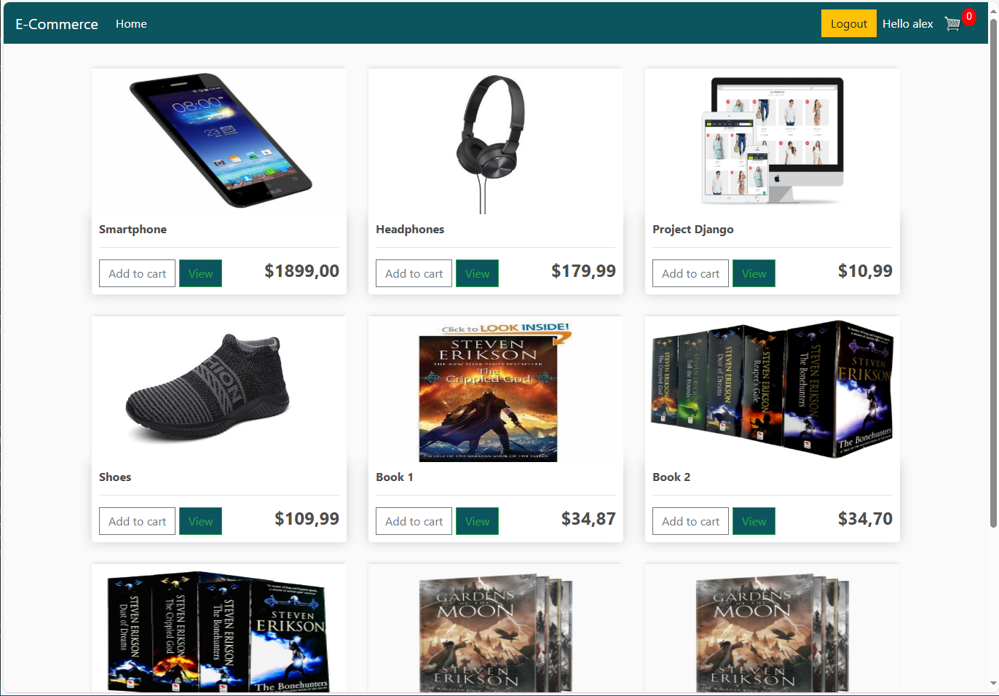
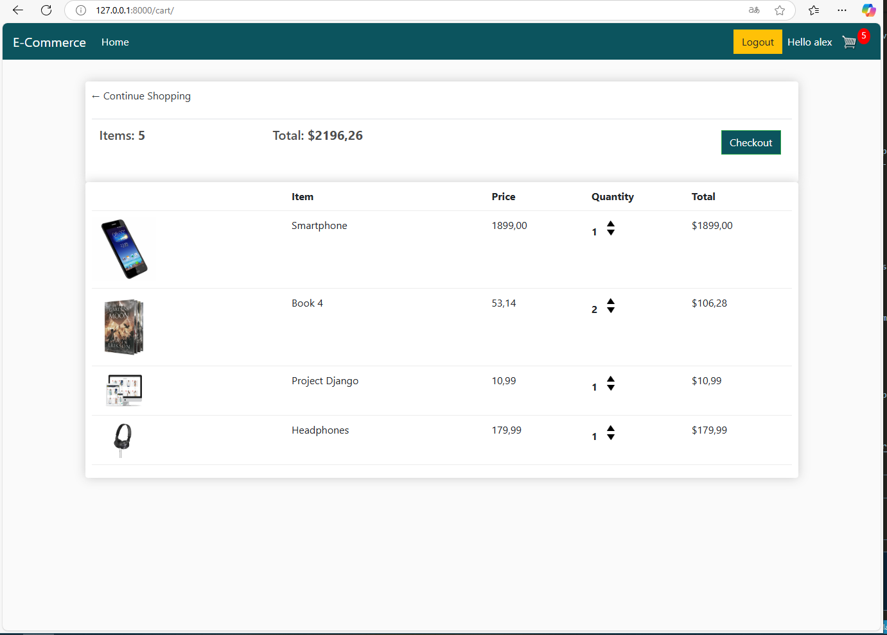
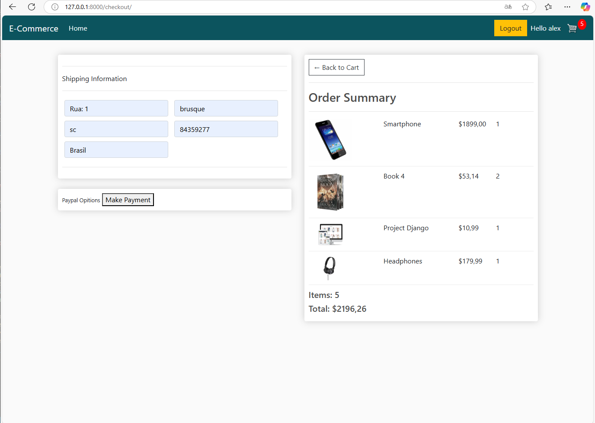
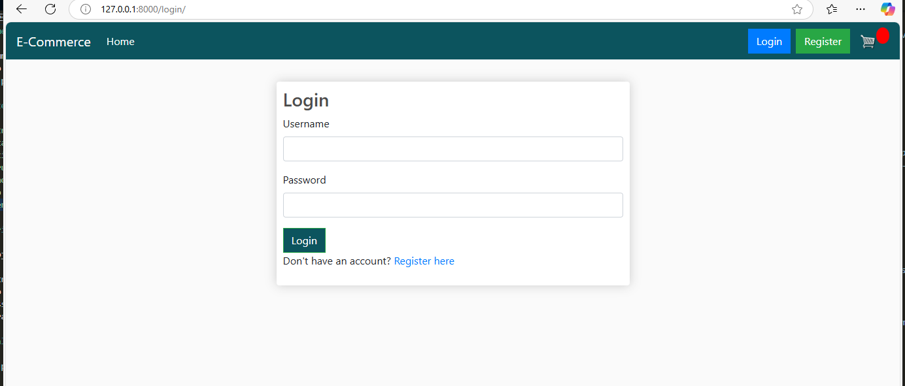

# E-Commerce Django Project

Este é um projeto simples de e-commerce desenvolvido em Django. Ele permite que os usuários naveguem por produtos, adicionem itens ao carrinho, façam pedidos e gerenciem suas contas. O foco está no aprendizado da linguagem Python e o Framework Django, porém inclui funcionalidades desenvolvidas com HTML, CSS, Bootstrap e Javascript.

## Índice

1. [Descrição](#descrição)
2. [Instalação](#instalação)
3. [Funcionalidades](#funcionalidades)
4. [Estrutura do Projeto](#estrutura-do-projeto)
5. [Tecnologias Utilizadas](#tecnologias-utilizadas)
6. [Como Contribuir](#como-contribuir)
7. [Licença](#licença)

## Descrição

Este projeto foi criado para simular um sistema de e-commerce simples mas funcional.  Ele inclui funcionalidades como:

- Cadastro e login de usuários.
- Adição e remoção de itens no carrinho.
- Processamento de pedidos.
- Integração com métodos de pagamento (em desenvolvimento).

### Tela Principal


### Carrinho


### Checkout


### Tela de Login



## Instalação

Siga os passos abaixo para configurar o projeto localmente:

1. Clone o repositório:
   ```bash
   git clone https://github.com/seu-usuario/ecommerce-django.git
   cd ecommerce-djangoCollecting workspace informationCriar uma documentação para o seu projeto é uma ótima ideia para facilitar a manutenção e o entendimento do sistema. Aqui está um guia para criar uma documentação básica e bem estruturada para o seu projeto Django.

2. Crie e ative um ambiente virtual:
   ```bash
   python -m venv .venv
   source .venv/bin/activate  # No Windows: .venv\Scripts\activate
   ```

3. Instale as dependências:
   ```bash
   pip install -r requirements.txt
   ```

4. Aplique as migrações:
   ```bash
   python manage.py makemigrations
   python manage.py migrate
   ```

5. Inicie o servidor:
   ```bash
   python manage.py runserver
   ```

6. Acesse o sistema em: [http://127.0.0.1:8000/](http://127.0.0.1:8000/)


## Funcionalidades

- **Usuários**:
  - Cadastro e login.
  - Logout.
- **Produtos**:
  - Listagem de produtos.
  - Visualização de detalhes do produto.
- **Carrinho de Compras**:
  - Adicionar e remover itens.
  - Exibir resumo do pedido.
- **Checkout**:
  - Preenchimento de informações de envio.
  - Processamento de pedidos.


## Estrutura do Projeto

```
E-Commerce/
├── core/
│   ├── settings.py        # Configurações do Django
│   ├── urls.py            # Rotas principais
│   ├── wsgi.py            # Configuração WSGI
│   └── asgi.py            # Configuração ASGI
├── store/
│   ├── models.py          # Modelos do banco de dados
│   ├── views.py           # Lógica das views
│   ├── urls.py            # Rotas da aplicação
│   ├── templates/         # Templates HTML
│   ├── static/            # Arquivos estáticos (CSS, JS, imagens)
│   └── utils.py           # Funções auxiliares
├── static/
│   ├── css/               # Arquivos CSS
│   ├── js/                # Arquivos JavaScript
│   └── images/            # Imagens do projeto
├── db.sqlite3             # Banco de dados SQLite
└── manage.py              # Gerenciador do Django
```

## Tecnologias Utilizadas

- **Backend**:
  - Django 5.1.7
  - SQLite
- **Frontend**:
  - HTML5
  - CSS3
  - Bootstrap 4
  - JavaScript
- **Outras**:
  - Python 3.13.1


## Como Contribuir

1. Faça um fork do repositório.
2. Crie um branch para sua feature:
   ```bash
   git checkout -b minha-feature
   ```
3. Faça commit das suas alterações:
   ```bash
   git commit -m "Minha nova feature"
   ```
4. Envie para o branch principal:
   ```bash
   git push origin minha-feature
   ```
5. Abra um Pull Request.

---

## Licença

Este projeto está licenciado sob a licença MIT. Consulte o arquivo `LICENSE` para mais informações.

